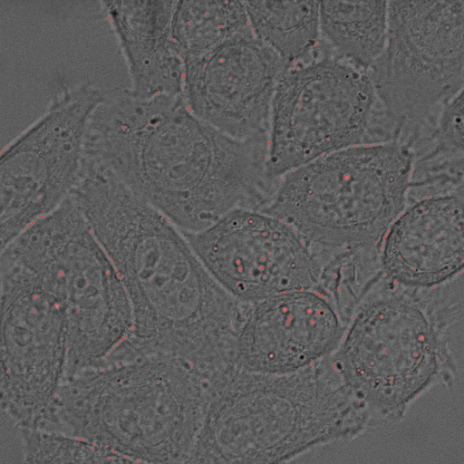

# Morpho-Analytics

**From data to proof in 30 seconds**  
A Docker-ready command-line tool for object tracking and morpho-dynamic analysis on image sequences.

---

## 🎬 Demo Animation

  
*(This GIF illustrates the transformation: command → visual result + metrics.)*

---

## Proofs & Visual Validation

### Overlay proof (red overlay on image)  


### Centroids over time (object positions across frames)  


---

## Quickstart with Docker

Run the analysis in minutes from the root of the project:

```bash
docker run --rm -v "$PWD/examples":/data eliotsystem/morpho-analytics:v0.1.9 report /data/synth.npy --out /data/report.json --fig /data/report.png
```

## Output schema (quick reference)

`report.json` (JSON records; one row per detection and per frame). Typical fields per record:

```
{
  "t": 12,
  "label": 5,
  "area": 1432,
  "centroid-0": 301.4,
  "centroid-1": 212.7,
  "mean_intensity": 0.47,
  "max_intensity": 0.93
}
```

Notes
- CSV export: add `--format csv` to write the detailed table as CSV.
- Summary aggregates: add `--summary-out summary.json` to also write a small summary (counts/avg_area...).

## Known limitations (v0.1.9)

- Naive intensity thresholding: robust and fast, but not designed for severe illumination drift or very low contrast without preprocessing.
- No inter-frame identity linking yet: `label` is per-frame; a stable `track_id` and events (birth/merge/split) are not part of v0.1.9.
- Assumes 3D NumPy array shaped `(T,H,W)`; filenames and paths are case‑sensitive.
- For reproducibility, pin `eliotsystem/morpho-analytics:v0.1.9`; `:latest` will update as CI runs.

### From Quickstart to Results (copy/paste)

If you just want a minimal, copy‑paste path from the Quickstart to seeing files appear:

1) Be in the project root so that `examples/` exists:

```
cd /path/to/morpho-analytics
```

2) Run the command (identical to Quickstart):

```
docker run --rm -v "$PWD/examples":/data \
  eliotsystem/morpho-analytics:v0.1.9 \
  report /data/synth.npy --out /data/report.json --fig /data/report.png
```

3) Verify the outputs were created next to the input:

```
ls -lh examples/report.json examples/report.png
```

4) (Optional) Peek the first lines of the JSON records:

```
sed -n '1,10p' examples/report.json
```

Notes
- The `-v "$PWD/examples":/data` mount means the container sees your local `examples/` as `/data`. Always pass `/data/<file>` to the CLI, not `examples/<file>`.
- Filenames are case‑sensitive on Linux.
- Pinning `:v0.1.9` ensures reproducibility; `:latest` is available once CI finishes.
